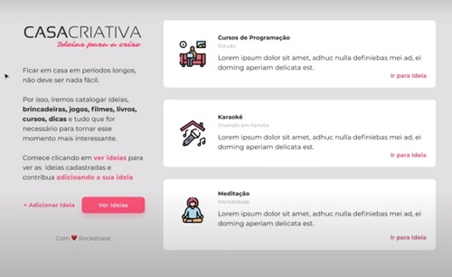

### Casa Criativa

Desenvolver uma aplicação para cadastrar ideias.

- Início  

- Nova Ideia 

- Ideias 

---

#### Frontend Web - Página Home 

- [x] 0. Rodar a aplicação: `npm run dev` 
- [x] 1. Introdução à programação WEB
- [x] 1. 1. O que é programação ?
- [x] 1. 1. 1. Ensinar o computador
- [x] 1. 1. 1. 1. Algoritmo 
- [x] 1. 1. 1. 1. 1. Passo a passo
- [x] 1. 1. 1. 1. 2. Conjunto de regras
- [x] 1. 1. 1. 2. Lógica de Programação 
- [x] 1. 1. 1. 2. 1. Maneira de pensar 
- [x] 1. 1. 1. 3. Sintaxe
- [x] 1. 1. 1. 3. 1. Maneira correta de escrever
- [x] 1. 2. Qual linguagem de programação ?
- [x] 1. 2. 1. Javascript
- [x] 2. Ambiente de Desenvolvimento 
- [x] 2. 1. Instalar o VSCode
- [x] 2. 2. Instalar o Node.js - Versão LTS v12.18.0 - v13.2.0
- [x] 2. 3. Instalar o Google Chrome
- [x] 3. Front-End e Back-End 
- [x] 3. 1. Imagina que ...
- [x] 3. 1. 1. Cliente chama, servidor escuta e responde
- [x] 3. 2. Como é feita a comunicação ?
- [x] 3. 2. 1. HTTP - HyperText Transfer Protocol
- [x] 3. 2. 2. URL - Localização universal 
- [x] 3. 2. 3. Troca de dados - pedido e resposta 
- [x] 3. 3. Tecnologias 
- [x] 3. 3. 1. Html - Estrutura 
- [x] 3. 3. 2. CSS - Estilização
- [x] 3. 3. 3. Javascript - Regras de Negócio
- [x] 4. Apresentação do projeto: casa criativa
- [x] 5. Estrutura do HTML: index.html
- [x] 5. 1. Estruturar os Elementos básicos do HTML
- [x] 5. 2. Emoji: `https://www.piliapp.com/facebook-symbols/`
- [x] 5. 3. CSS no HTML: Cascading StyleSheet

####  Frontend Web - Página Nova Ideia  

- [x] 2. Estilização do formulário de nova ideia
- [x] 2. 1. Box 
- [x] 2. 1. 1. Largura
- [x] 2. 1. 2. Altura
- [x] 2. 1. 3. Conteúdo de Caixa
- [x] 2. 1. 4. Espaçamentos
- [x] 2. 1. 5. Preenchimento
- [x] 2. 1. 6. Bordas
- [x] 2. 1. 7. Posicionamento
- [x] 2. 2. Cores e Fontes
- [x] 2. 3. Refatorando detalhes da estilização

####  Frontend Web - Página Ideias  

- [x] 3. Página Ideias
- [x] 3.1. Estrutura HTML
- [x] 3.2. Estilização CSS
- [x] 3.2.1. mesmo arquivo style, com id page-ideas
- [x] 3.2.2. css menu: #page-ideas header nav li a
- [x] 3.2.3. css sessão de ideias: #page-ideas section #title p h1
- [x] 3.2.4. refatorando css scroll 
- [x] 3.2.5. refatorando tamanho da página nova ideia
- [x] 3.2.6. refatorando detalhes

####  Backend 

- [x] 4. Backend
- [x] 4.1. Responsabilidades
- [x] 4.1.1. receber pedidos do cliente
- [x] 4.1.2. devolver respostas para o cliente
- [x] 4.1.3. regras de negócio
- [x] 4.1.4. dados
- [x] 4.2. Tecnologias
- [x] 4.2.1. Nodejs
- [x] 4.2.2. BD
- [x] 4.3. Servidor [Backend]
- [x] 4.3.1. criar servidor: server.js 
- [x] 4.3.2. npm init -y
- [x] 4.3.3. configurar o servidor 
- [x] 4.3.4.1. instalar o express - 4.17.1 - npm install express
- [x] 4.3.4.2. nodemon - reiniciar servidor automaticamente - `npm install nodemon` - v1.18.11
- [x] 4.3.5. Rotas
- [x] 4.3.6. Nunjucks: npm i nunjucks
- [x] 4.3.6.1. configurar nunjucks
- [x] 4.4. bug de estilização do formulário de nova ideia
- [x] 4.4.1. em telas maiores, corta os botões 
- [x] 4.5. Usando Nunjuck,exibir os dados dinamicamente com estrutura de repetição
- [x] 4.5.1. página home
- [x] 4.5.1.2. exibindo a mais recente adicionada
- [x] 4.5.2. página ideas
- [x] 4.5.2.2. exibindo a mais recente adicionada
- [x] 4.6. Refatorar código
- [x] 4.6.1. reduzir a repetição de código com nunjucks
- [x] 4.6.2. modal.html
- [x] 4.6.3. allIdeas.html
- [x] 4.6.4. layout.html

####  Banco de Dados

- [x] 5. Banco de dados
- [x] 5.1. Porque criar um db para a aplicação ?
- [x] 5.1.1. dados não podem ficar na aplicação
- [x] 5.1.2. perder ou corromper
- [x] 5.1.3. segurança
- [x] 5.1.4. responsabilidades
- [x] 5.2. SQL
- [x] 5.2.1. structured query language 
- [x] 5.2.2. linguagem para consultar, criar, atualizar, listar, deletar, ...
- [x] 5.2.3. tabelas/entidades/relações - colunas e linhas
- [x] 5.3. Tecnologias 
- [x] 5.3.1. SQLite
- [x] 5.3.1.1. open source
- [x] 5.3.1.2. fácil configuração de ambiente
- [x] 5.3.1.3. db relacional 
- [x] 5.3.1.4. ótima opção para iniciar as ações com sql
- [x] 5.4. Instalar o SQLite3
- [x] 5.4.1. `npm install sqlite3`
- [x] 5.4.2. `db.js`: configurações do banco de dados
- [x] 5.4.3. CRUD
- [x] 5.4.3.1.1. create
- [x] 5.4.3.1.2. executar `node db.js`
- [x] 5.4.3.1.3. criado `ws.db`
- [x] 5.4.3.2. insert:`node db.js` 
- [x] 5.4.3.3. select:`node db.js`
- [x] 5.4.3.4. delete:`node db.js`
- [ ] 5.5. Integrar o db com nossa aplicação
- [x] 5.5.1. warning: imagens sumiram 
- [x] 5.5.1.1. solução: no arquivo allideas.html, os formatos dos arquivos devem bater com os tipos criados no banco de dados.

---

#### Comentários no decorrer da implementação
1. Servidor Web do VSCode no plugin: Live Server. Botão direito no index.html `http://127.0.0.1:5500/index.html`
2. Icons: `https://www.flaticon.com/packs/stay-at-home-13` 
3. Fonts: `https://fonts.google.com/` 

---
 
.: Por Douglas A B Novato - @douglasabnovato
- De Mayk Brito [Canal no Youtube - Rocketseat](https://www.youtube.com/playlist?list=PL85ITvJ7FLohGTWaE_p0J6B-TLmQbN4ka)